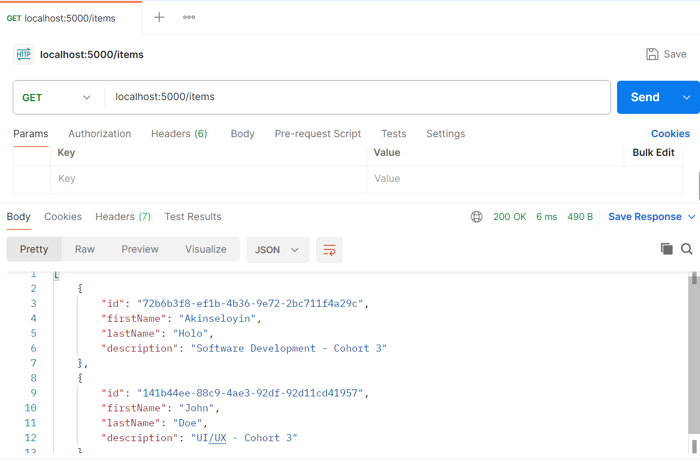

# Express.js Application

A basic Express.js application featuring:
 - A root URL that returns `Hello World!` message
 - A `/items` API with full CRUD functionality
 - Query filtering for item fields like `firstName`, `lastName`, or `description`
 - Middleware for parsing JSON
 - Proper error handling for unknown routes and bad requests
 - Input validation using `express-validator`
 - File-based data persistence using `fs` (`itemsData.json`) for in-memory

## Features
- Create, Read, Update, Delete (CRUD) operations for user records
- Input validation for new user creation
- In-memory data store with UUID for unique user IDs
- JSON parsing middleware
- Clean error responses (400, 404, 500)

## Project Structure
.
├── controllers/
│   └── items.js
├── data/
│   └── itemsData.json
├── routes/
│   └── items.js
├── index.js
├── assets/
│   ├── Hello-World!.png
│   └── example-postman-API-request.png
    └── Hello-World!.png
└── README.md

## Example Usage
`
```js
   // index.js
import express from "express";
import itemsRoutes from './routes/items.js';

const app = express();  
const PORT = 5000;

app.use(express.json());

app.get('/', (req, res) => res.send("Hello World!"));

app.use('/', itemsRoutes);
```

```js
   // routes/items.js
import express from "express";
import { getItems, createItem, getItem, deleteItem, putItem } from "../controllers/items.js";
import { body, validationResult } from "express-validator";

const router = express.Router();

router.get('/items', getItems);
router.get('/items/:id', getItem);

router.post(
  '/',
  [
    body('firstName').notEmpty().withMessage('First name is required'),
    body('lastName').notEmpty().withMessage('Last name is required'),
    body('description').notEmpty().withMessage('Description is required')
  ],
  (req, res) => {
    const errors = validationResult(req);
    if (!errors.isEmpty()) {
      return res.status(400).json({ errors: errors.array() });
    }
    createItem(req, res);
  }
);

router.patch('/items/:id', putItem);
router.delete('/items/:id', deleteItem);

export default router;
```
`
## screenshot




## Tech Stack
- Node.js
- Express.js
- Postman (for testing)
- UUID
- express-validator

## Author
Akinseloyin Holo
Fellow ID
FE/23/55210926
Cohort 3

